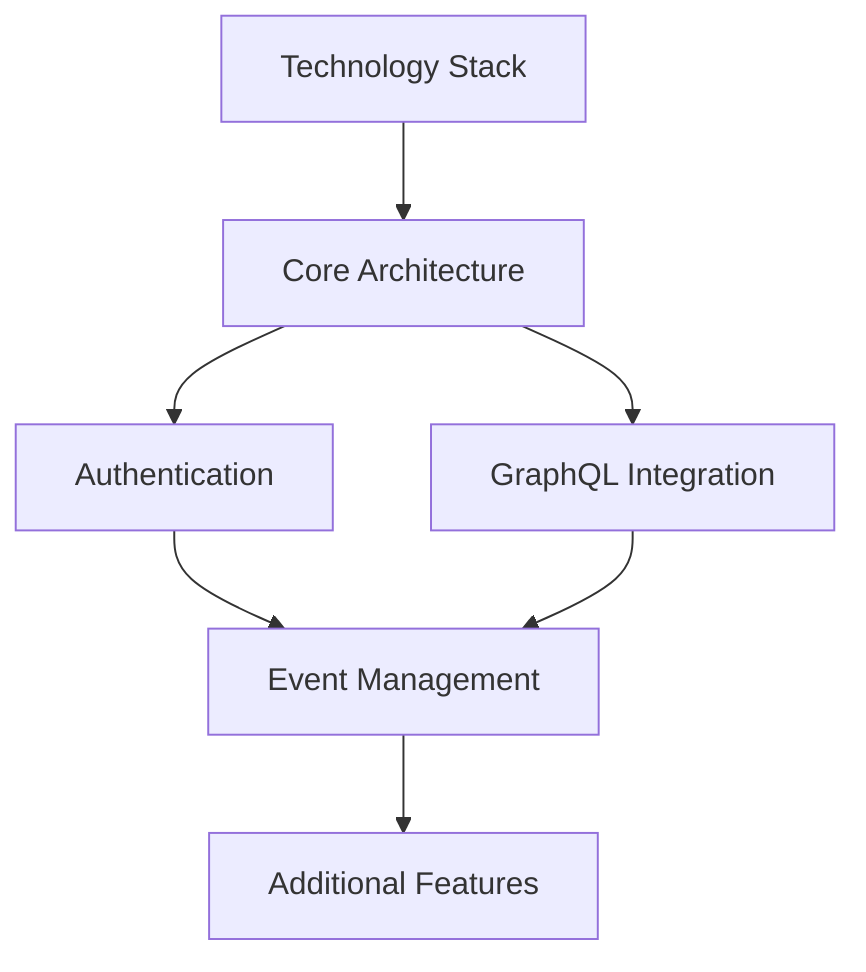
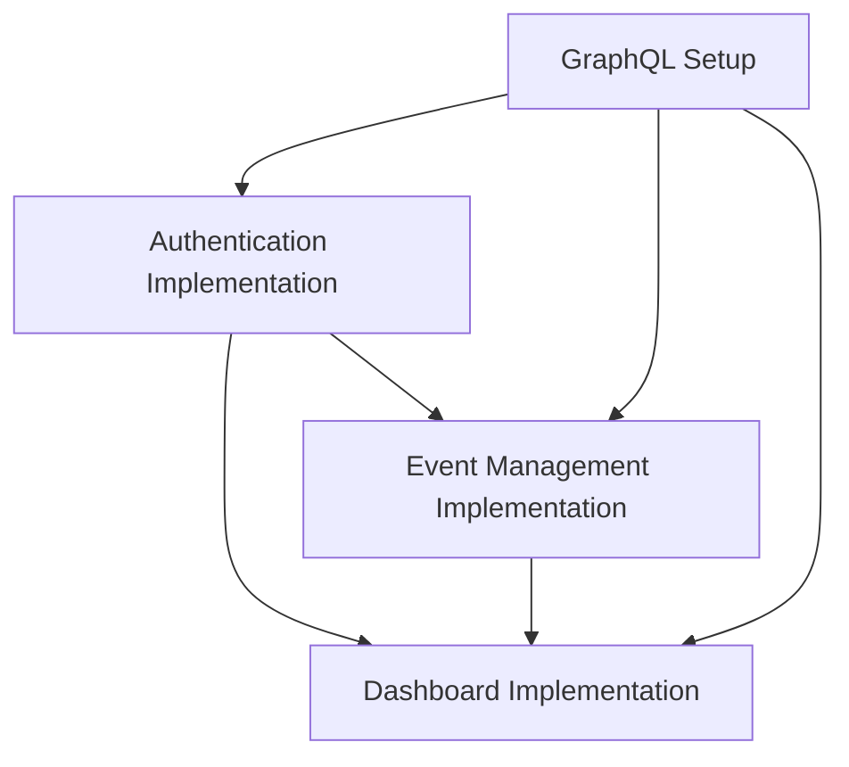

# VolunteerSync Frontend Documentation

## 📋 Overview

This repository contains the complete frontend documentation for VolunteerSync, a comprehensive volunteer management platform built with Angular 20. The documentation is organized into atomic specifications and detailed implementation plans following industry best practices for maintainability and machine-readability.

## 🏗️ Documentation Architecture

### Specifications (`/spec/`)

Atomic, comprehensive specifications that define requirements, constraints, interfaces, and acceptance criteria for specific domains.

### Implementation Plans (`/plan/`)

Detailed, executable plans that provide step-by-step guidance for implementing features based on the specifications.

## 📚 Core Specifications

### Architecture & Foundation

#### [Frontend Core Architecture](spec/spec-architecture-frontend-core-1.0.md)

**Purpose**: Foundational architecture patterns and design principles  
**Key Topics**: Angular v20 standalone components, signals, lazy loading, modular structure  
**Requirements**: AR-001 through AR-004 covering component patterns, state management, and performance  
**Dependencies**: Technology stack specification

#### [Technology Stack](spec/spec-technology-stack-frontend-1.0.md)

**Purpose**: Complete technology choices with justifications and integration patterns  
**Key Topics**: Angular v20, Material Design, TypeScript strict mode, build optimization  
**Requirements**: TSR-001 through TSR-004 covering framework setup, UI library, and tooling  
**Dependencies**: Core architecture specification

### Process & Domain Specifications

#### [Authentication & Authorization](spec/spec-process-authentication-authorization-1.0.md)

**Purpose**: Complete authentication workflows including OAuth, JWT, and security  
**Key Topics**: Multi-method registration, JWT strategy, role-based access control (RBAC)  
**Requirements**: AR-001 through AZ-003 covering registration, authentication, and permissions  
**Dependencies**: Technology stack, GraphQL integration

#### [Event Management Lifecycle](spec/spec-process-event-management-lifecycle-1.0.md)

**Purpose**: Complete event lifecycle from creation through completion  
**Key Topics**: Event creation, discovery, registration workflows, organizer tools  
**Requirements**: ECM-001 through OTA-003 covering creation, search, registration, and management  
**Dependencies**: Authentication system, real-time notifications

#### [GraphQL Data Integration](spec/spec-data-graphql-integration-1.0.md)

**Purpose**: Apollo Client integration, caching, error handling, and performance  
**Key Topics**: Apollo setup, intelligent caching, real-time subscriptions, type safety  
**Requirements**: ACC-001 through SAC-002 covering client configuration and data flow  
**Dependencies**: Authentication system, WebSocket infrastructure

## 🚀 Implementation Plans

### Core Feature Implementation

#### [Authentication Implementation](plan/plan-authentication-implementation-1.0.md)

**Goal**: Implement complete authentication and authorization system  
**Timeline**: 6-8 weeks with 2-3 developers  
**Phases**: 7 phases with 49 detailed tasks covering OAuth, JWT, RBAC, and security  
**Key Deliverables**: Registration/login flows, role management, security features

#### [Event Management Implementation](plan/plan-event-management-implementation-1.0.md)

**Goal**: Implement comprehensive event management system  
**Timeline**: 12-16 weeks with 3-4 developers  
**Phases**: 8 phases with 56 detailed tasks covering creation, discovery, registration, calendar integration  
**Key Deliverables**: Event CRUD, registration workflows, calendar sync, organizer tools

#### [Dashboard Implementation](plan/plan-dashboard-implementation-1.0.md)

**Goal**: Implement complete user dashboard system  
**Timeline**: 10-14 weeks with 3-4 developers  
**Phases**: 8 phases with 56 detailed tasks covering analytics, widgets, personalization  
**Key Deliverables**: Role-based dashboards, real-time widgets, data visualization

## 🎯 Quick Start Guide

### For Developers

1. **Architecture First**: Start with [Frontend Core Architecture](spec/spec-architecture-frontend-core-1.0.md) to understand foundational patterns
2. **Technology Setup**: Review [Technology Stack](spec/spec-technology-stack-frontend-1.0.md) for environment configuration
3. **Implementation Order**: Begin with [Authentication Implementation](plan/plan-authentication-implementation-1.0.md) as foundation

### For Project Managers

1. **Master Plan**: Review [Documentation Refactor Plan](plan/refactor-specification-documentation-1.0.md) for complete project overview
2. **Resource Planning**: Each implementation plan includes effort estimates and team size recommendations
3. **Dependencies**: Implementation plans clearly outline dependencies between features

### For Architects

1. **System Design**: [GraphQL Data Integration](spec/spec-data-graphql-integration-1.0.md) defines complete data layer architecture
2. **Security Model**: [Authentication & Authorization](spec/spec-process-authentication-authorization-1.0.md) covers security architecture
3. **Performance**: Each specification includes performance requirements and optimization strategies

## 📖 Specification Standards

All specifications follow a consistent structure:

- **Purpose & Scope**: Clear definition of what is covered
- **Definitions**: Unambiguous terminology
- **Requirements & Constraints**: Explicit, testable requirements
- **Interfaces & Data Contracts**: Precise technical contracts
- **Acceptance Criteria**: Measurable success criteria
- **Test Automation Strategy**: Comprehensive testing approach
- **Rationale & Context**: Decision justifications
- **Dependencies**: Clear prerequisite relationships

## 🛠️ Implementation Plan Standards

All implementation plans follow a consistent structure:

- **Requirements & Constraints**: Functional and technical requirements
- **Implementation Steps**: Detailed phases with specific tasks
- **Alternatives**: Evaluated options and decision rationale
- **Dependencies**: Technical and resource dependencies
- **Files**: Complete file structure and organization
- **Testing**: Comprehensive testing strategy with examples
- **Risks & Assumptions**: Risk mitigation and assumption validation

## 🔄 Cross-References

### Specification Dependencies



### Implementation Dependencies



## 📋 Requirements Traceability

### Authentication System (AR-001 through AZ-003)

- **Specification**: [Authentication & Authorization](spec/spec-process-authentication-authorization-1.0.md)
- **Implementation**: [Authentication Implementation](plan/plan-authentication-implementation-1.0.md)
- **Tasks**: TASK-001 through TASK-049 in implementation plan

### Event Management (ECM-001 through OTA-003)

- **Specification**: [Event Management Lifecycle](spec/spec-process-event-management-lifecycle-1.0.md)
- **Implementation**: [Event Management Implementation](plan/plan-event-management-implementation-1.0.md)
- **Tasks**: TASK-001 through TASK-056 in implementation plan

### Data Integration (ACC-001 through SAC-002)

- **Specification**: [GraphQL Data Integration](spec/spec-data-graphql-integration-1.0.md)
- **Implementation**: Integrated across authentication and event management plans
- **Tasks**: GraphQL setup tasks in multiple implementation phases

## 🧪 Testing Strategy

### Specification Validation

Each specification includes:

- **Acceptance Criteria**: Measurable validation points
- **Test Automation Strategy**: Unit, integration, and E2E testing approaches
- **Validation Criteria**: Performance benchmarks and quality gates

### Implementation Testing

Each implementation plan includes:

- **Unit Testing**: Component and service testing with coverage targets
- **Integration Testing**: Cross-component and API integration testing
- **E2E Testing**: Complete user journey testing with Cypress
- **Performance Testing**: Load testing and performance validation

## 📊 Project Metrics

### Documentation Coverage

- **5 Core Specifications**: 100% complete with comprehensive requirements
- **3 Implementation Plans**: 100% complete with detailed task breakdown
- **Total Requirements**: 50+ explicit requirements across all domains
- **Total Tasks**: 161+ specific implementation tasks

### Estimated Implementation Timeline

- **Authentication System**: 6-8 weeks
- **Event Management**: 12-16 weeks
- **Dashboard System**: 10-14 weeks
- **Total Project**: 28-38 weeks with proper team scaling

### Quality Metrics

- **Requirement Traceability**: 100% requirements linked to implementation tasks
- **Test Coverage Target**: 90%+ unit test coverage, 80%+ integration coverage
- **Performance Targets**: <2s page loads, <500ms API responses, <1s search results

## 🔧 Development Setup

### Prerequisites

- Node.js 20+ with npm/yarn/bun
- Angular CLI 20+
- Git with conventional commit setup
- VS Code with Angular extensions

### Environment Configuration

```bash
# Clone repository
git clone <repository-url>
cd VolunteerSync_Frontend

# Install dependencies
npm install

# Setup environment
cp src/environments/environment.example.ts src/environments/environment.ts

# Start development server
npm run start
```

### Code Standards

- **TypeScript**: Strict mode enabled, explicit types required
- **Linting**: ESLint with Angular-specific rules
- **Formatting**: Prettier with consistent configuration
- **Testing**: Jest for unit tests, Cypress for E2E tests
- **Commits**: Conventional commit format required

## 📞 Support & Contribution

### Getting Help

- **Technical Questions**: Create issue with `question` label
- **Bug Reports**: Use bug report template with reproduction steps
- **Feature Requests**: Use feature request template with use case

### Contributing

1. **Fork Repository**: Create personal fork for development
2. **Feature Branch**: Create branch from `develop` with descriptive name
3. **Follow Standards**: Adhere to code standards and specification guidelines
4. **Test Coverage**: Ensure comprehensive test coverage for changes
5. **Documentation**: Update specifications and plans as needed
6. **Pull Request**: Submit PR with clear description and testing evidence

### Code Review Process

- **Automated Checks**: All CI/CD checks must pass
- **Peer Review**: At least one team member approval required
- **Architecture Review**: Senior developer approval for architectural changes
- **Documentation Review**: Technical writer approval for specification changes

## 📝 Changelog & Versioning

### Version Format

- **Specifications**: `MAJOR.MINOR` (e.g., 1.0, 1.1, 2.0)
- **Implementation Plans**: `MAJOR.MINOR` aligned with specifications
- **Software**: Semantic versioning `MAJOR.MINOR.PATCH`

### Change Management

- **Breaking Changes**: Major version increment required
- **New Features**: Minor version increment for backward-compatible additions
- **Bug Fixes**: Patch version for fixes without specification changes
- **Documentation**: Track changes in specification front matter

## 🎉 Acknowledgments

This documentation structure follows industry best practices for:

- **Atomic Documentation**: Single responsibility principle for documents
- **Machine Readability**: Structured format for automated processing
- **Traceability**: Clear links between requirements and implementation
- **Maintainability**: Version control and change management
- **Collaboration**: Clear ownership and review processes

---

**Documentation Version**: 1.0  
**Last Updated**: 2025-09-04  
**Maintained By**: Frontend Development Team  
**Review Cycle**: Quarterly review and update process  
**Contact**: [Team Lead Email] for questions and clarifications
